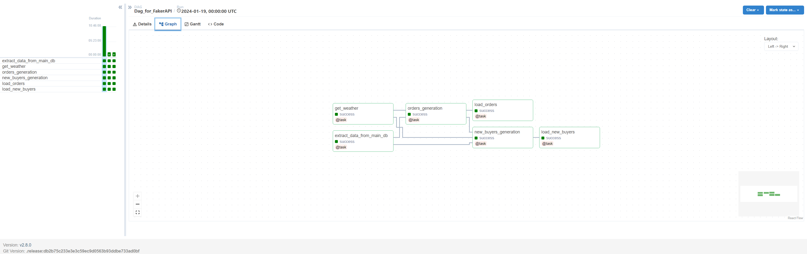

# DAG для получения данных из API и загрузки их в базу данных

Этот DAG представляет собой процесс получения данных и загрузки этих данных в базу данных. DAG запускается ежедневно и автоматически выполняет следующие шаги.

## Логика создания фейковых заказов:

1. **Получение данных о погоде**: В рамках DAG происходит отправка запроса к API для получения информации
о погоде, именно максимальной и минимальной температуры на следующий день для заданной широты и долготы.
Полученные данные о температуре будут использованы для определения количества заказов.

2. **Извлечение максимальных значений ID покупателей и продуктов**: DAG выполняет SQL-запросы в основную базу
данных, чтобы получить текущие максимальные значения ID покупателей и продуктов. Эти значения сохраняются 
в переменных, чтобы быть использованными при генерации фейковых заказов.

3. **Генерация заказов**: Количество заказов, которое будет сгенерировано, зависит от текущей даты,
температуры и заданных коэффициентов. Затем полученные значения перемножаются с округлением вверх 
и используются для генерации фейковых заказов.
---
* Коэффициент `temperature_coefficient` в данном DAG используются для вычисления количества генерируемых фейковых 
заказов в зависимости от средней температуры на завтрашний день.

* Коэффициент `daily_coefficient` в данном DAG используются для вычисления количества генерируемых фейковых 
заказов в зависимости от текущей даты (`day_number`). Вот более подробная информация о логике вычисления 
этих коэффициентов:

   1. Если `day_number` (текущий день) меньше 12:
      - `daily_coefficient` вычисляется как абсолютное значение отношения 1 к разнице между `day_number` и 12: 1 / (day_number - 12).
      - Это значение затем делится на 1 и вычитается 0.098: abs(1 / (`day_number` - 12)) / 1 - 0.098.
      - Таким образом, чем ближе `day_number` к 12, тем выше значение `daily_coefficient` будет.

   2. Если `day_number` равен 12:
      - `daily_coefficient` принимает значение 1.
      - Это означает, что в день 12 будет сгенерировано наибольшее количество заказов.

   3. Если `day_number` больше 12:
      - `daily_coefficient` вычисляется как разница между 1 и отношением между `day_number` и 12, деленным на 20: 1 - (`day_number` - 12) / 20.
      - Это значение будет уменьшаться с увеличением `day_number`, и в результате будет сгенерировано меньшее количество заказов.

Значение `daily_coefficient` используется вместе с другими коэффициентами, связанными с температурой,
для определения общего количества генерируемых фейковых заказов. В результате, в зависимости от текущей даты и 
температуры, будет сгенерировано разное количество заказов. 

**Это помогает имитировать разные сезонные колебания спроса и тестировать систему обработки заказов на различных нагрузках.**

---

5. **Генерация новых покупателей и создание связанных с ними заказов**: DAG генерирует новых покупателей и
создает связанные с ними заказы. Количество новых покупателей зависит от заданного коэффициента.
Для каждого нового покупателя генерируется уникальный идентификатор и создаются связанные заказы с 
использованием текущей даты и других параметров.

6. **Загрузка заказов в базу данных**: Готовые фейковые заказы загружаются в базу данных, 
чтобы быть доступными для дальнейшего анализа и использования.

## Запуск и использование

Этот DAG запускается автоматически ежедневно в заданное время, как настроено в расписании. 
Вся необходимая логика и операции выполняются автоматически, в зависимости от текущей даты, данных о погоде и заданных коэффициентов.

Вы можете увидеть прогресс выполнения DAG, просматривая логи и метаданные на веб-интерфейсе Apache Airflow.

  

**Для правильной работы DAG, необходимо настроить `Connections` и прописать `Variables`**